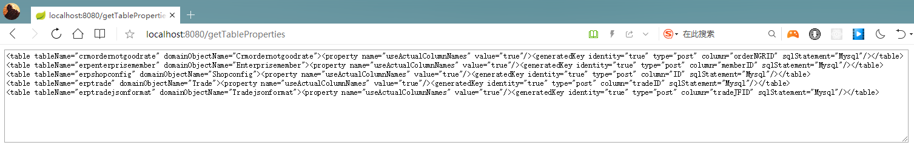

# 2019-05-29 更新
近期，又研读了一次《阿里巴巴Java开发手册（详尽版）》（[从这里可以下载](https://github.com/alibaba/p3c)），又思考了关于 MySQL 的表名、字段名的命名范围。

打算在以后的新项目中完全遵循《阿里巴巴Java开发手册（详尽版）》的规范。

与本仓库的 MySQL 表名、字段名，采用的是驼峰命名法(CamelCase)，与《阿里巴巴Java开发手册（详尽版）》的规范冲突，需要改为下划线命名法(UnderScoreCase)。

关于数据库表名、字段名的命名规范，是要采用与 Java 代码的字段名和方法名一样的驼峰命名法(CamelCase)还是采用业界绝大多数团队使用的下划线命名法(UnderScoreCase)，仁者见仁，智者见智。

作为团队规范的制定者，需要综合考虑各个方面的因素，之前我在面对这个问题的时候，考虑到数据库的每一张表都会对应一个 POJO，如果表字段是下划线命名法，POJO 也是，这就导致了同样是 java 类的命名规范的不一致，在写代码的时候很别扭。

现在如果有一个方案，在既保持数据库表与字段采用下划线命名法的同时，对应 POJO 又是驼峰命名法，这样既可以兼顾数据库的业界范围，又可以兼顾 Java 开发的业界范围，这才是完美的解决方案。

近期会去找这样的方案，敬请期待。

## 2019-06-18
针对数据库字段使用下划线命名法，生成相应实体时，使用 java 普遍使用的驼峰命名法的配置，将 create-table-property 项目的 application.yml 的配置 `flagUseActualColumnNames` 改为 false：
```
  # 是否使用原始字段名
  flagUseActualColumnNames: false
```

这样，还需要在 mybatis-config.xml 做相应配置：
```
<configuration>
    <settings>
        <!-- 开启驼峰映射 ，为自定义的SQL语句服务-->
        <!-- 设置启用数据库字段下划线映射到java对象的驼峰式命名属性，默认为false-->
        <!-- 即从经典数据库列名 A_COLUMN 到经典Java 属性名 aColumn 的类似映射 -->
        <setting name="mapUnderscoreToCamelCase" value="true"/>
    </settings>
</configuration>
```

# MyBatis Generator (MBG)，写扩展类，以适应 MySQL 大小写敏感配置的各种情况、适应分表时动态替换表名
## 生成表属性
两种方式
1. `create-table-property` 工程采用 spring boot v2.1.1 创建，可直接运行，使用 tomcat 的默认端口8080，运行之后，访问：`http://localhost:8080/getTableProperties`
    
1. 运行测试`WithApplicationContextTest.getTablePropertiesTest`，从控制台查看。

## 项目地址
- github: https://github.com/uncleAndyChen/mybatis-generator
- gitee:  https://gitee.com/uncleAndyChen/mybatis-generator

如果觉得不错，欢迎star以表支持。

## 子项目
- MBG扩展类：https://github.com/uncleAndyChen/mybatis-generator/tree/master/mybatis-generator-enhance
- 生成MBG表配置内容：https://github.com/uncleAndyChen/mybatis-generator/tree/master/create-table-property

## 建议在实际工作中的运行方式 
cmd窗口运行jar文件，可以直接用本项目根目录下的两个jar文件和配置文件，稍作修改应该就可以用了。

- 下MBG的jar包，[传送门](https://github.com/mybatis/generator/releases)，解压，找到`mybatis-generator-1.3.7.jar`备用。
- 将本模块生成jar文件，生成的jar文件名`mybatis-generator-enhance.jar`。
- 将两个jar文件以及配置文件放到model与dal项目所在的目录下，在 cmd 窗口执行：
```
java -Dfile.encoding=UTF-8 -cp mybatis-generator-1.3.7.jar;mybatis-generator-enhance.jar org.mybatis.generator.api.ShellRunner -configfile generatorConfig.xml -overwrite
```
> 这里通过 -cp 指定需要用到的所有jar包，用分号隔开，这样在运行的时候才能找到相应的类。

### 通过本项目，可以学到的知识点
1. 可以理解使用MBG的大致流程。
1. 本文中用到的MBG配置可以作为一个标准配置的参考。
1. spring boot 2.1.1 获取 application.yml 配置信息，项目【create-table-property】是一个很好的参考。
1. 通过MBG如何生成dal与model项目。
    - 生成的代码，绝大部分可直接使用，比如简单的增、删、改、查。
    - 对应数据库表的实体类，一张表一个实体类，可用于在各层传递基于表数据的业务数据。
1. 通过 IDEA 管理多项目。
    - 获取项目源码，用 IDEA 导入的时候，指向根目录的 pom.xml 即可。

### 更新记录
- 2018-12-12
    - 11号的修改，仅在 MySQL 5.7.x 下测试通过。在 MySQL 8.0.11 下，由于驱动版本低导致连接数据库失败，所以，改回支持最新版的 8.x。
    - 增加在 MySQL 5.7.x 下运行该如何操作的说明，请查看[MBG扩展类](https://github.com/uncleAndyChen/mybatis-generator/tree/master/mybatis-generator-enhance)。总体来说，仅需要修改驱动版本和驱动名即可。8.x 驱动名，由`com.mysql.jdbc.Driver`改为`com.mysql.cj.jdbc.Driver`了。
    - 将支持 MySQL 5.7.x 的 `mybatis-generator-enhance.jar` 改名为 `mybatis-generator-enhance-mysql-v5.7.x.jar`，同时增加支持 MySQL 8.x 的包 `mybatis-generator-enhance-mysql-v8.x.jar`。
- 2018-12-11
    - 重构，将之前直接修改源码的方式，改为通过扩展类来实现自己需要的业务，相当于是一个新项目了。
    - 数据库驱动`mysql-connector-java 8.0.13`不变的情况下，数据库由8.x换到5.7.x之后，现出以下两类错误：
        - 报错
        ```
        Cannot obtain primary key information from the database, generated objects may be incomplete
        ...
        ```
        - 生成的 mapper 缺少以下接口：
        ```
        deleteByPrimaryKey
        selectByPrimaryKey
        updateByPrimaryKeySelective
        updateByPrimaryKey
        ```
        - **解决**：将`mysql-connector-java`由高版本的8.X换成低版本的5.1.x。高版本8.x的驱动连接8.x数据库是正常的，但是换成低版本的数据库5.7.x版本，就会有问题。[参考](https://blog.csdn.net/jpf254/article/details/79571396)
- 2018-12-09
    - 将 MBG 版本由 1.3.5 升级至当前最新版 1.3.7。
    - 将 mybatis 由 3.4.1 升级至 3.4.6。
    - 修改和完善本说明文档。
    - 重构生成表配置的类：`CreateTablePropertyService`，优化完善了相关代码、添加数据库的各种配置信息，更易于使用和维护。
    - 将生成表配置的类`CreateTablePropertyService`单独提取至一个独立的项目，以尽可能少的修改官方项目`mybatis-generator-core`源码。
    - 重命名model与dal模块名，更易于理解。
    - 在根目录添加 pom.xml，方便 IDEA 通过该文件直接导入。

## 先了解一下 lower_case_table_names 参数 
官方文档：[Identifier Case Sensitivity](https://dev.mysql.com/doc/refman/5.7/en/identifier-case-sensitivity.html)

1. lower_case_table_names是mysql一个大小写敏感设置的属性，此参数不可以动态修改，必须重启数据库。
1. unix,linux下lower_case_table_names默认值为 0 .Windows下默认值是 1 .Mac OS X下默认值是 2。

参数说明
- `lower_case_table_names=0` 表名存储为给定的大小写。比较时：区分大小写。大小写敏感（Unix，Linux默认）。
>　创建的库表将原样保存在磁盘上。如create database TeSt;将会创建一个TeSt的目录，create table AbCCC ...将会原样生成AbCCC.frm。SQL语句也会原样解析。

- `lower_case_table_names=1` 表名存储为小写。比较时：不区分大小写。大小写不敏感（Windows默认）。
> 创建的库表时，MySQL将所有的库表名转换成小写存储在磁盘上。SQL语句同样会将库表名转换成小写。如需要查询以前创建的Test_table（生成Test_table.frm文件），即便执行select * from Test_table，也会被转换成select * from test_table，致使报错表不存在。

- `lower_case_table_names=2` 表名存储为给定的大小写。比较时：小写。
> 创建的库表将原样保存在磁盘上。但SQL语句将库表名转换成小写。

## 不适用场景
如果开发环境、生产环境均配置成1或者2，则本文中有关大小写敏感的措施都是无意义的。

但是如果分库时依赖表名替换，则又是适用的，见以下【适用场景】中的场景二。

## 适用场景
最终目标：MBG 生成的xml文件中的sql脚本的表名，保持与对应表名在建表时的大小写一致，保持大小写敏感（表名可在MBG需要的配置文件中配置，以该配置为准）。这样可以适应以上`lower_case_table_names`的三种配置值。

**为了达到以上目标，[运行生成表配置内容的项目](https://github.com/uncleAndyChen/mybatis-generator/tree/master/create-table-property)，一定要连接参数`lower_case_table_names`配置为0或者2的数据库服务器**，并且是配置为0或者2之后才创建的数据表，否则，生成的表配置内容的表名，是以全部小写为基准的，并非驼峰式命名法。表配置内容生成好之后，重新生成 mapper 时连接的数据库服务器的`lower_case_table_names`配置值，对生成结果没有影响。

### 适用场景一
1. 其中有数据库服务器被设置成大小写不敏感（比如阿里云的云数据库，截至目前2018年12月9号，还不支持配置成大小写敏感），即 `lower_case_table_names=1`，且该参数不能修改。
1. 为了统一命名规范使用驼峰式命名法，包括：数据库名、数据库表名、数据库字段名、编程语言。这样的话，可以控制`lower_case_table_names`的linux服务器，就可以将该参数设置为0，即大小写敏感。
1. 用 MGB 生成的 Mapper 类名，以及 xml 文件中的表名，需要与创建表名时的原始大小写一致，以适应在`lower_case_table_names=0`（linux）或者`lower_case_table_names=2`（windows）的情况。

当然，读到这里，你可能会觉得奇怪，数据库的库名、表名、字段名，业界都是用下划线分开的，其余字母全是小写，所以，该参数被配置成什么都不需要关心。

如果你也这么认为，那么，本文对你是没有价值的。

本文要解决的问题是，数据库的库名、表名、字段名，需要保持跟 Java 的编码规范一致的场景。如果都统一成一种编码规则，比如统一用驼峰式命名法，那么，不用在两种编码习惯上切换，可以提高编码效率和减少不必要的麻烦，且继续往下看。

### 适用场景二
- 分表，利用MyBatis插件，根据业务规则，对表名进行动态替换。
- 如`erpTrade`表分成了120个表，那么在某一次业务操作中，需要将`erpTrade`替换成`erpTrade_xyz`，其中`xyz`为从`001`到`120`的其中一个数字，则需要将MBG生成的xml里sql脚本中的表名用 \`（左上角数字键1左边、Tab键上边、Esc键下边的键）引起来。
> 将会分享我的基于 MyBatis 插件分库分表项目。

# 需求场景
1. 首先，我项目的 Java 代码规范是变量命名应用驼峰式命名法（Camel-Case）。数据库表名及字段名，则用下划线命名法（即用下划线分隔不同单词）。
1. 我用 MBG 生成的代码，通过配置可以将下划线去掉，同时将下划线后的第一个字母转为大写，这样是符合驼峰式命名法的。
1. 但是，问题来了。我们项目前后端分离，前端调用 Restful Api，在传递的参数中难免需要以表名来定义对象，而以字段名作为对象的属性来传递参数，而 Java 写的 Api 在接收参数时，是用 Pojo 来跟前端传的参数匹配的。
1. 这样有两个问题，前端在传参数的时候需要将表名和字段名由下划线命名法转为驼峰式命名法，Java 代码也以同样的方式定义对应的类名以及属性字段，在这个过程中，容易出错，相对直接 copy 表名及字段名，需要做额外的工作，而且前后端都有。
1. 如果数据库表名和字段名本身就是驼峰式命名法的话，写代码的时候直接 copy 表名或字段名，这样既不容易出错，还能节省时间。说干就干，改！表名及字段名遵循驼峰式命名法。
1. 这样做的目的无非是让大家能偷偷懒，还减少出错的概率，同时也轻松的达到了统一代码规范的目的。
1. 在windows环境下，如果遇到`lower_case_table_names=1`或者该参数未配置（未配置的时候默认为1），运行MBG，生成的sql脚本，全是小写，需要花费额外时间来解决环境问题。
1. 为了一劳永逸，有了本文和对应的项目。
1. 随着业务发展，到了需要分库分表的时候，本文所解决的问题，更是不可或缺。

## 生成表配置信息的 Java 工具类
MBG 基于一个 xml 配置文件，在这个配置文件里，有跟表相关的配置，为了达到我的需求，需要一张表对应一行配置信息，所以，我写了一个类来自动生成，这样，在增减表，或者别的项目里面，可以简单的运行这个类来生成，减少手工劳动。

更详细的，请看：https://github.com/uncleAndyChen/mybatis-generator/tree/master/create-table-property

MBG需要的配置文件比较全面的，在工作中实际用到的文件内容如下：
```xml
<?xml version="1.0" encoding="UTF-8"?>
<!DOCTYPE generatorConfiguration
        PUBLIC "-//mybatis.org//DTD MyBatis Generator Configuration 1.0//EN"
        "http://mybatis.org/dtd/mybatis-generator-config_1_0.dtd">
<generatorConfiguration>
    <!--数据库驱动-->
    <classPathEntry location="mysql-connector-java-5.1.31.jar"/>
    <!--<context id="DB2Tables" targetRuntime="MyBatis3">-->
    <!--如果你希望不生成和Example查询有关的内容，那么可以按照如下进行配置:-->
    <!--<context id="DB2Tables" targetRuntime="MyBatis3Impl">-->
    <context id="Mysql" targetRuntime="MyBatis3" defaultModelType="flat">
    <!--<context id="Mysql" targetRuntime="MyBatis3Simple" defaultModelType="flat">-->
        <commentGenerator>
            <property name="suppressDate" value="true"/>
            <property name="suppressAllComments" value="true"/>
        </commentGenerator>
        <!--数据库链接地址账号密码-->
        <jdbcConnection driverClass="com.mysql.jdbc.Driver" connectionURL="jdbc:mysql://192.168.0.130:3306/mbg?useUnivalue=true&amp;characterEncoding=utf8&amp;autoReconnect=true&amp;failOverReadOnly=false"
                        userId="root" password="root">
        </jdbcConnection>
        <javaTypeResolver>
            <property name="forceBigDecimals" value="false"/>
        </javaTypeResolver>
        <!--生成Model类存放位置-->
        <javaModelGenerator targetPackage="mybatis.generator.model.entity" targetProject="mybatis.generator.model/src/main/java/">
            <property name="enableSubPackages" value="true"/>
            <property name="trimStrings" value="true"/>
        </javaModelGenerator>
        <!--生成映射文件存放位置-->
        <sqlMapGenerator targetPackage="mappers\original" targetProject="mybatis.generator.dal\src\main\resources">
            <property name="enableSubPackages" value="true"/>
        </sqlMapGenerator>
        <!--生成Dao类存放位置
        当type=XMLMAPPER时，会生成一个XXX.xml文件内有各种sql语句，是mapper的实现。
        当type=ANNOTATEDMAPPER时，会直接在mapper接口上添加注释。
        -->
        <!--
        http://blog.csdn.net/qq_27376871/article/details/51360638
        MyBatis3:
        ANNOTATEDMAPPER:基于注解的Mapper接口，不会有对应的XML映射文件
        MIXEDMAPPER:XML和注解的混合形式，(上面这种情况中的)SqlProvider注解方法会被XML替代。
        XMLMAPPER:所有的方法都在XML中，接口调用依赖XML文件。
        MyBatis3Simple:
        ANNOTATEDMAPPER:基于注解的Mapper接口，不会有对应的XML映射文件
        XMLMAPPER:所有的方法都在XML中，接口调用依赖XML文件。
        -->
        <javaClientGenerator type="XMLMAPPER" targetPackage="mybatis.generator.dal.mapper"
                             targetProject="mybatis.generator.dal/src/main/java/">
            <property name="enableSubPackages" value="true"/>
        </javaClientGenerator>
        <!--生成对应表及类名-->
        <table tableName="erpEnterpriseMember" domainObjectName="EnterpriseMember"><property name="useActualColumnNames" value="true"/><generatedKey identity="true" type="post" column="memberID" sqlStatement="Mysql"/></table>
        <table tableName="erpShopConfig" domainObjectName="ShopConfig"><property name="useActualColumnNames" value="true"/><generatedKey identity="true" type="post" column="ID" sqlStatement="Mysql"/></table>
        <table tableName="erpTrade" domainObjectName="erpTrade"><property name="useActualColumnNames" value="true"/><generatedKey identity="true" type="post" column="tradeID" sqlStatement="Mysql"/></table>
    </context>
</generatorConfiguration>
```

## 注意事项
1. 当表结构发生变化时，需要重新运行 MBG 生成新的代码，所以，生成的代码，不能有修改行为，否则下次重新生成后，改过的代码会被覆盖。
1. 重新生成时，*Mapper.xml 文件会被追加内容，而不是重新生成该文件，所以是有问题的，应对方法就是每次重新生成之前将旧的文件删除。
1. 下面的脚本在window下测试通过，删除脚本和生成脚本一起执行即可。重新生成之后，如果文件内容跟原来一致，文件会被认为无修改。
1. 需要注意的是，如果执行删除全部文件操作，需要保证所有表的配置保持与数据库同步，表配置相当重要，有则生成。
```
# 注意：*Mapper.xml 文件，每次重新生成都需要先删除，否则部分内容会重复生成，导致错误，版本1.3.5以及现在最新版1.3.7均有此问题。
# 执行之前请确保文件路径是正确的。

del/f/s/q C:\workspace\mybatis-generator\demo-domain-dal\src\main\java\demo\domain\dal\mapper\original\*.*
del/f/s/q C:\workspace\mybatis-generator\demo-domain-model\src\main\java\demo\domain\model\entity\*.*

del/f/s/q C:\workspace\mybatis-generator\demo-domain-dal\src\main\resources\mappers\original\*.xml
java -Dfile.encoding=UTF-8 -cp mybatis-generator-1.3.7.jar;mybatis-generator-enhance-mysql-v8.x.jar org.mybatis.generator.api.ShellRunner -configfile generatorConfig.xml -overwrite

# 如果 mysql 用的是5.7.x，先将本文档中的 com.mysql.cj.jdbc.Driver 改为 com.mysql.jdbc.Driver，然后执行下面的脚本，如果用的是mysql 8.x，则不用修改直接执行上面一行脚本
java -Dfile.encoding=UTF-8 -cp mybatis-generator-1.3.7.jar;mybatis-generator-enhance-mysql-v5.7.x.jar org.mybatis.generator.api.ShellRunner -configfile generatorConfig.xml -overwrite
```

# 经验
如果库里有一张 user，在用 MBG 生成代码文件的时候，可能会遇到类似如下的提示信息：
```
Table Configuration user matched more than one table (forTest..user,mysql..user,xunwu..user,bbs..user)
Column userId, specified as an identity column in table user, does not exist in the table.
Column userId, specified as an identity column in table user, does not exist in the table.
Column userId, specified as an identity column in table user, does not exist in the table.
```
意思是，在多个库里都存在 user 表，而其中有三个库中的 user 表不存在 userId 这个字段。

所以，在作业务表设计的时候，最好给所有表名加上能区别业务的前缀，这样可以有效避免与其它库的表名冲突，这样做不光是为了适应 MBG，在做业务开发的时候同样会带来好处。在做类设计的时候，适当的添加前缀或者后缀，也能让人一下子知道类的作用，这需要在实际工作中才能体会到。
